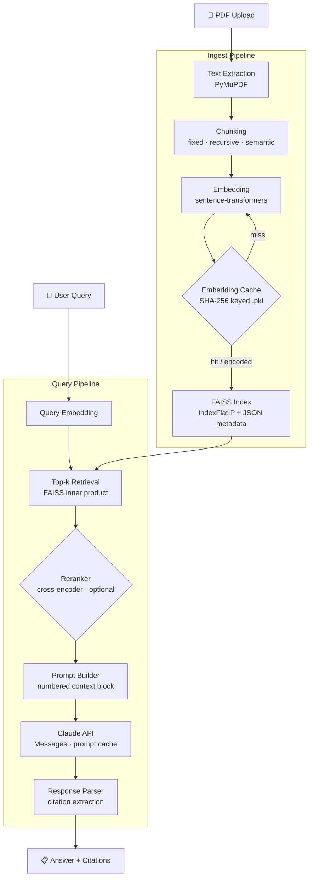
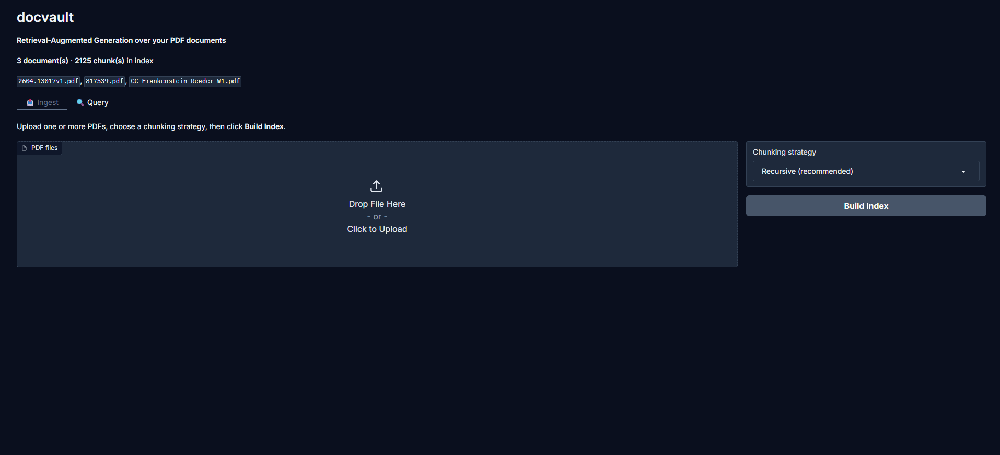
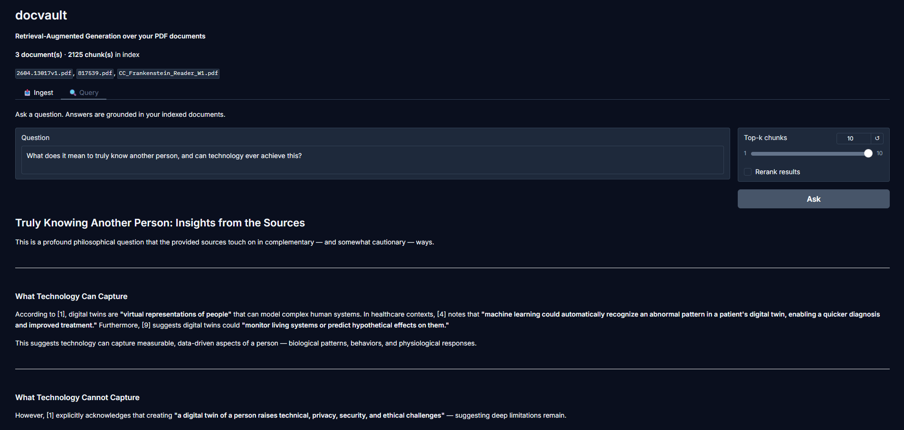
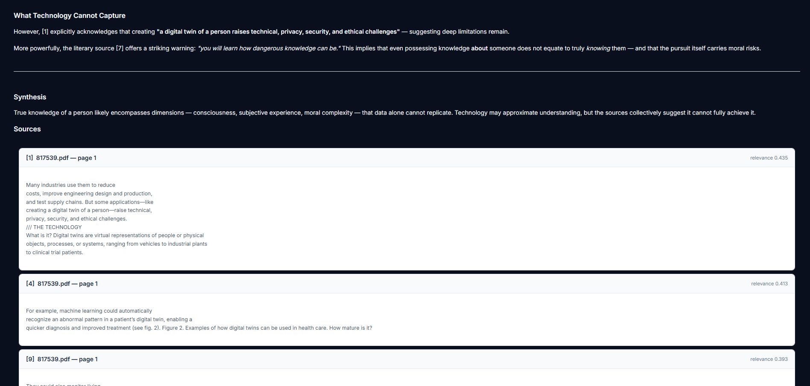
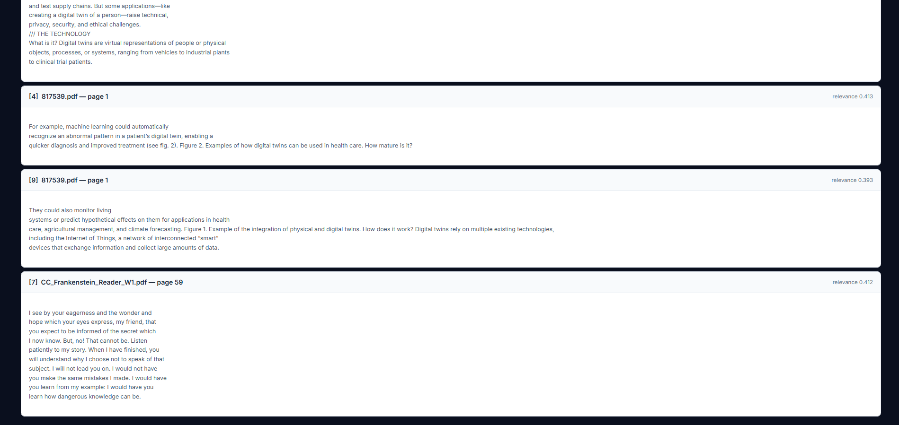

# docvault

> Retrieval-Augmented Generation over your PDF documents — built from scratch with FAISS, sentence-transformers, and the Anthropic Claude API.


---

## Architecture



---

## Demo

### Upload your documents



Drop any PDFs into the **Ingest** tab and click **Ingest Documents** to chunk, embed, and index them in one step.

### Ask a question



Type a question, adjust the **Top-K** slider to control how many chunks are retrieved, and get a cited answer from Claude.

### Synthesis and source cards



Scroll down to see the full synthesis alongside the source cards that back up each claim.

### Citation detail



Expand any citation card to see the document name, page number, relevance score, and the exact chunk text that was used.

---

## Features

- **Zero framework dependencies** — no LangChain, no LlamaIndex; every component is built on base libraries
- **Three chunking strategies** — fixed-size, recursive character, and embedding-based semantic chunking
- **FAISS `IndexFlatIP`** — exact cosine similarity search via inner product on unit-normalised vectors
- **SHA-256 embedding cache** — avoids re-encoding chunks that haven't changed between ingest runs
- **Incremental indexing** — add new documents to an existing index without a full rebuild
- **Optional cross-encoder reranking** — `cross-encoder/ms-marco-MiniLM-L-6-v2` re-scores top-k candidates for higher precision
- **Source citations** — every answer includes `[N]` markers mapped back to document name, page number, relevance score, and the exact chunk text
- **Anthropic prompt caching** — system message is marked `cache_control: ephemeral` so repeated queries against the same system prompt hit the cache
- **Gradio demo** — two-tab UI for ingesting PDFs and querying with expandable citation cards
- **CLI tools** — `scripts/ingest_docs.py` and `scripts/query.py` for terminal workflows

---

## Quickstart

### 1. Clone and install

```bash
git clone https://github.com/traelynbrasseaux/docvault.git
cd docvault
pip install -e ".[dev]"
```

> **Windows note:** If you see a CUDA/torch mismatch, install the CPU-only torch wheel first:
> ```powershell
> pip install torch --index-url https://download.pytorch.org/whl/cpu
> pip install -e ".[dev]"
> ```

### 2. Set your API key

```bash
# Unix / macOS
cp .env.example .env

# Windows (PowerShell)
Copy-Item .env.example .env
```

Open `.env` and replace `your_api_key_here` with your Anthropic API key:

```
ANTHROPIC_API_KEY=sk-ant-...
```

### 3. Get sample documents

Three documents are included in `data/sample_docs/` for immediate use:

| File | Title | Source | License |
|---|---|---|---|
| `CC_Frankenstein_Reader_W1.pdf` | *Frankenstein* — Mary Shelley | Core Classics edition | CC BY 4.0 |
| `817539.pdf` | *Digital Twins: Virtual Models of People and Objects* | U.S. Government Accountability Office | Public domain (U.S. government work) |
| `2604.13017v1.pdf` | *PAL: Personal Adaptive Learner* — Chakraborty et al. | arXiv:2604.13017 | CC BY 4.0 |

To use your own documents instead, drop any `.pdf` files into `data/sample_docs/` and re-run the ingest step.

### 4. Ingest documents

**CLI:**
```bash
# Unix / macOS
python -m scripts.ingest_docs --input-dir data/sample_docs --strategy recursive

# Windows (PowerShell)
python -m scripts.ingest_docs --input-dir data\sample_docs --strategy recursive
```

Sample output:
```
docvault ingest
  Input dir : data/sample_docs
  PDFs found: 2
  Strategy  : recursive
  Chunk size: 512 chars  (overlap: 64)
  Index dir : data/indexes

Ingest complete
  Documents processed : 2
  Chunks created      : 147
  New embeddings      : 147
  Cached embeddings   : 0
  Total index vectors : 147
  Index file size     : 38.2 KB
  Index location      : data/indexes/docvault.faiss
```

### 5. Query

**CLI:**
```bash
python -m scripts.query "What are the key findings?" --top-k 5
```

With reranking:
```bash
python -m scripts.query "What methodology was used?" --top-k 10 --rerank
```

**Gradio demo:**
```bash
python demo/app.py
# Open http://localhost:7860 in your browser
```

---

## Chunking Strategies

All three strategies receive the same configuration values (`CHUNK_SIZE`, `CHUNK_OVERLAP`) and produce `Chunk` objects carrying identical metadata. The difference is how the input text is carved up.

### Fixed-size

Splits text into sentences using a punctuation-aware regex, then **greedily fills** each chunk until adding the next sentence would exceed `CHUNK_SIZE` characters. Overlap is achieved by back-tracking: the next chunk starts from the earliest sentence whose trailing characters sum to `~CHUNK_OVERLAP`.

```
Input:  "RAG combines retrieval with generation. Lewis et al. introduced it in 2020.
         The method has become widely adopted. It reduces hallucination significantly.
         Multiple chunking strategies exist for splitting documents."

CHUNK_SIZE=120, CHUNK_OVERLAP=40

Chunk 0 │ RAG combines retrieval with generation. Lewis et al. introduced it in 2020.
Chunk 1 │ The method has become widely adopted. It reduces hallucination significantly.
            ↑ overlap: "Lewis et al. introduced it in 2020." appears in both
Chunk 2 │ It reduces hallucination significantly. Multiple chunking strategies exist.
```

**Best for:** Simple, predictable splits. Low overhead.

---

### Recursive character

Uses a **three-level hierarchy**: first splits on paragraph separators (`\n\n`), then on sentence boundaries if a paragraph exceeds `CHUNK_SIZE`, then on word boundaries if a single sentence is still too long. The result respects natural document structure — paragraphs stay together when they fit.

```
Input:  "Section A is about retrieval. It uses dense vectors.\n\n
         Section B covers generation. Large language models produce the answer.
         The context window limits how much can be provided at once."

CHUNK_SIZE=120, CHUNK_OVERLAP=40

Chunk 0 │ Section A is about retrieval. It uses dense vectors.
          └─ paragraph fits → kept whole
Chunk 1 │ Section B covers generation. Large language models produce the answer.
          └─ paragraph > limit → split at sentence boundary
Chunk 2 │ Large language models produce the answer. The context window limits …
          ↑ overlap carries the last sentence of chunk 1
```

**Best for:** Structured documents (reports, papers). Preserves paragraph coherence.

---

### Semantic

Embeds every sentence with the same sentence-transformer model used for retrieval, then computes **cosine similarity between consecutive sentences**. A new chunk boundary is inserted whenever similarity drops below `similarity_threshold` (default `0.5`) or the accumulated length exceeds `CHUNK_SIZE`.

```
Input:  S1: "RAG combines retrieval with generation."       sim(S1,S2)=0.81 ──┐ merge
         S2: "Dense vectors represent each document chunk."  sim(S2,S3)=0.72 ──┘ merge → Chunk 0
         S3: "The encoder maps queries to the same space."   sim(S3,S4)=0.31 ──┐ split here
         S4: "Hallucination is a key problem in LLMs."       sim(S4,S5)=0.68 ──┘ merge → Chunk 1
         S5: "Grounding reduces incorrect claims."

Chunk 0 │ RAG combines retrieval with generation. Dense vectors represent each document chunk.
          The encoder maps queries to the same space.
Chunk 1 │ Hallucination is a key problem in LLMs. Grounding reduces incorrect claims.
```

**Best for:** Long documents with thematic shifts. Higher quality retrieval at the cost of encoder inference at ingest time.

---

## Configuration Reference

All values are read from `.env` (via `python-dotenv`) with the shown defaults. Override any variable by editing `.env` or exporting it in your shell.

| Variable | Default | Description |
|---|---|---|
| `ANTHROPIC_API_KEY` | *(required)* | Your Anthropic API key. Never commit this value. |
| `EMBEDDING_MODEL` | `all-MiniLM-L6-v2` | Sentence-transformer model for encoding chunks and queries. |
| `CHUNK_SIZE` | `512` | Target character count per chunk across all strategies. |
| `CHUNK_OVERLAP` | `64` | Approximate character overlap between adjacent chunks. |
| `TOP_K` | `5` | Number of chunks retrieved per query. |
| `LLM_MODEL` | `claude-sonnet-4-6` | Claude model ID used for answer generation. |
| `INDEX_DIR` | `data/indexes` | Directory where the FAISS index and metadata files are saved. |
| `DATA_DIR` | `data` | Root data directory (used by CLI scripts as a default base). |
| `RERANK` | `false` | Set to `true` to enable cross-encoder reranking after retrieval. |
| `RERANK_MODEL` | `cross-encoder/ms-marco-MiniLM-L-6-v2` | Cross-encoder model for reranking. |
| `RERANK_TOP_N` | `3` | Number of results to keep after reranking (must be ≤ `TOP_K`). |
| `EMBEDDING_BATCH_SIZE` | `64` | Sentence-transformer batch size during ingest encoding. |
| `MAX_CONTEXT_TOKENS` | `6000` | Approximate token budget for retrieved context in the prompt. |
| `LLM_MAX_TOKENS` | `1024` | Maximum tokens in the Claude response. |
| `LLM_TEMPERATURE` | `0.2` | Sampling temperature (lower = more deterministic). |

---

## Project Structure

```
docvault/
├── .env.example                  # Environment variable template
├── .gitignore
├── LICENSE                       # MIT
├── pyproject.toml                # Build config + dependencies (hatchling)
│
├── src/docvault/
│   ├── config.py                 # Dataclass config — reads from .env
│   ├── pipeline.py               # End-to-end orchestrator (ingest + query)
│   │
│   ├── ingest/
│   │   ├── extract.py            # PDF text extraction (PyMuPDF)
│   │   ├── chunking.py           # Fixed / recursive / semantic strategies
│   │   └── metadata.py           # Chunk + ChunkMetadata dataclasses
│   │
│   ├── embeddings/
│   │   ├── encoder.py            # SentenceTransformer wrapper, unit normalisation
│   │   └── cache.py              # SHA-256 keyed pickle cache
│   │
│   ├── retrieval/
│   │   ├── index.py              # VectorIndex — FAISS IndexFlatIP, save/load/remove
│   │   ├── search.py             # Searcher — query embed + top-k retrieval
│   │   └── reranker.py           # CrossEncoder reranker (optional)
│   │
│   └── generation/
│       ├── prompt.py             # Numbered context block + system message
│       ├── client.py             # Anthropic Messages API wrapper + retries
│       └── response.py           # Citation extraction → CitedSource + Response
│
├── demo/
│   └── app.py                    # Gradio Blocks UI (two tabs: Ingest + Query)
│
├── scripts/
│   ├── ingest_docs.py            # CLI: ingest a folder of PDFs
│   └── query.py                  # CLI: query the index, print answer + citations
│
├── tests/
│   ├── test_chunking.py          # 29 tests — all three strategies, overlap, coverage
│   ├── test_embeddings.py        # 23 tests — encoder shape/norm, cache hit/miss
│   ├── test_retrieval.py         # 29 tests — index roundtrip, search order, k-cap
│   └── test_pipeline.py         # 22 tests — integration with mock encoder + LLM
│
├── data/
│   ├── sample_docs/              # Drop your PDFs here
│   └── indexes/                  # Auto-generated: .faiss, _chunks.json, .pkl
│
└── notebooks/
    └── 01_chunking_exploration.ipynb   # Visual comparison of chunking strategies
```

---

## How It Works

### Stage 1 — Text Extraction

`ingest/extract.py` opens each PDF with **PyMuPDF** (`fitz`). Every page's text is extracted via `page.get_text()`. The module handles three edge cases gracefully:

- **Encrypted PDFs** — detected via `doc.is_encrypted`; skipped with a warning.
- **Empty pages** — pages with no text content are silently dropped.
- **Image-only pages** — detected when `page.get_images()` returns results but `get_text()` is empty; a warning is logged explaining that OCR is not supported.

Output is a list of `{doc_name, page_number, text}` dicts — one per non-empty page.

### Stage 2 — Chunking

`ingest/chunking.py` converts raw page text into `Chunk` objects, each carrying a `ChunkMetadata` record (doc name, page number, chunk index, strategy, char count). Three strategies are available (see [Chunking Strategies](#chunking-strategies) above).

A global `chunk_index` counter is threaded through `chunk_pages()` so indices are unique across all pages in a document — important for the FAISS metadata mapping.

### Stage 3 — Embedding

`embeddings/encoder.py` wraps `sentence_transformers.SentenceTransformer`. All vectors are **L2-normalised to unit length** via `normalize_embeddings=True`, making inner product equivalent to cosine similarity. Device selection is automatic: CUDA if available, otherwise CPU.

`embeddings/cache.py` computes `SHA-256(doc_name + "::" + chunk_text)` as the cache key. On a re-ingest, already-cached chunks bypass the encoder entirely and their embeddings are read from a `.pkl` file on disk.

### Stage 4 — Indexing

`retrieval/index.py` builds a **`faiss.IndexFlatIP`** (exact inner-product search). Two files are written to `INDEX_DIR`:

- `docvault.faiss` — the serialised FAISS index
- `docvault_chunks.json` — a parallel JSON array of chunk dicts in index-row order

Incremental updates call `index.add(new_vectors)` on the loaded index. `remove_doc()` uses `IndexFlatIP.reconstruct_n` to pull all vectors back into NumPy, filter the target document, and rebuild — no re-embedding required.

### Stage 5 — Retrieval

`retrieval/search.py` embeds the query with the same encoder (`encode_query` returns a `(1, D)` array), then calls `index.search(query_vec, k)`. Because both sides are unit vectors, scores are cosine similarities in `[-1, 1]`. Results are returned as `SearchResult(chunk, score)` sorted descending.

`top_k` is capped at `index.ntotal` to prevent FAISS from returning `-1` padding entries.

### Stage 6 — Reranking (optional)

`retrieval/reranker.py` wraps `sentence_transformers.CrossEncoder`. When `RERANK=true`, the top-k bi-encoder results are paired with the query and scored in a single batched forward pass. Cross-encoder scores replace the bi-encoder scores in-place, so downstream code always works with the best available relevance signal.

### Stage 7 — Generation

`generation/prompt.py` assembles the prompt:

```
System: "You are a helpful assistant that answers questions based only on the
         provided context … Always cite which document and page number …"

User:   Context:

        [1] From 'report.pdf', page 3 (relevance: 0.891):
        <chunk text>

        [2] From 'paper.pdf', page 7 (relevance: 0.854):
        <chunk text>

        Question: What are the key findings?
```

A token budget (`MAX_CONTEXT_TOKENS`) gates how many chunks are included; lower-scoring chunks are dropped when the budget is exhausted.

`generation/client.py` sends the prompt to **Claude** via the Anthropic Messages API. The system turn is decorated with `cache_control: ephemeral` for prompt caching — repeated queries that share the same system message benefit from a cache hit on the static portion, reducing latency and cost. Up to 3 retry attempts with exponential back-off handle rate limits and transient connection errors.

### Stage 8 — Response Parsing

`generation/response.py` scans the LLM reply for `[N]` citation markers using a regex. Each matched number is mapped to `included_results[N-1]` (the exact subset of chunks that appeared in the prompt). Out-of-range citations (model hallucination) are logged and skipped. The final `Response` object carries the answer text, a list of `CitedSource` records, and the full result set for display.

---

## Running the Tests

```bash
# Run all tests
pytest

# With coverage report
pytest --cov=docvault --cov-report=term-missing

# Run a single file
pytest tests/test_chunking.py -v
```

The test suite (103 tests across 4 files) uses mocks for the sentence-transformer model and Anthropic client — no API key or internet connection is needed to run tests. FAISS is tested against the real library since it installs cleanly as a pure binary wheel.

---

## Limitations & Future Work

### Current limitations

| Limitation | Detail |
|---|---|
| No OCR support | Scanned / image-only PDFs are skipped with a warning. A future version could integrate Tesseract or a vision model. |
| Single-user | The Gradio demo uses a module-level `Pipeline` instance with no auth or session isolation. Not suitable for multi-user deployment as-is. |
| No streaming | Responses are returned only after the full completion is received. Streaming via `client.messages.stream()` would improve perceived latency. |
| Character-based chunk size | `CHUNK_SIZE` measures characters, not tokens. At 512 chars, chunks are well within the `all-MiniLM-L6-v2` 256-token limit, but very dense text may be truncated by the encoder silently. |
| English-centric sentence splitter | The regex sentence splitter assumes English punctuation conventions. Non-English documents or heavy use of abbreviations may produce suboptimal splits. |

### Potential future additions

- **Hybrid search (BM25 + dense)** — combine keyword recall with semantic search using `rank_bm25` and reciprocal rank fusion
- **Multi-modal indexing** — embed figures and tables via CLIP or a vision-language model alongside text chunks
- **Streaming generation** — yield tokens progressively in the Gradio UI via `client.messages.stream()`
- **Metadata filtering** — allow queries to be scoped to a specific document or date range before FAISS search
- **Re-ingestion deduplication** — track document hashes to skip unchanged files entirely on repeated ingest runs
- **HNSW / IVF index** — swap `IndexFlatIP` for `IndexHNSWFlat` or `IndexIVFFlat` for sub-linear search at very large scale (100k+ chunks)

---

## Hardware Notes

Developed and tested on:

| Component | Spec |
|---|---|
| GPU | NVIDIA GeForce RTX 5070 |
| CPU | AMD Ryzen 7 7800X3D |
| RAM | 32 GB DDR5 |
| OS | Windows 11 Home |
| Python | 3.10 |

The embedding encoder (`all-MiniLM-L6-v2`) runs on GPU automatically when CUDA is available, reducing ingest time significantly for large document sets. FAISS index search runs on CPU regardless (using `faiss-cpu`). The Anthropic API call dominates query latency at ~1–3 seconds per response.

---

## License

MIT License — see [LICENSE](LICENSE) for full text.

Copyright © 2026 Traelyn Brasseaux
